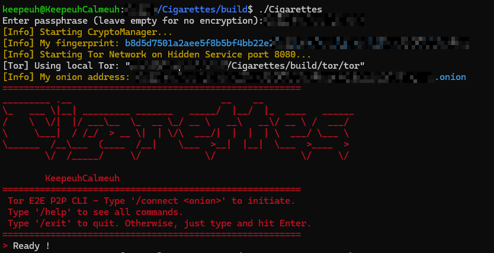
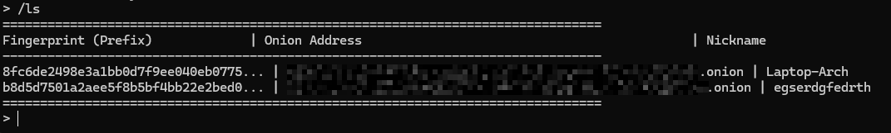

# Cigarettes 

**Cigarettes** is a high-security, lightweight, decentralized P2P messenger built in modern C++. Operating exclusively over the **Tor Network** as a v3 Hidden Service, it provides absolute location anonymity, zero tracking metadata, and robust End-to-End Encryption (E2EE) powered by OpenSSL 3.

---



## Key Features

* **Network Anonymity via Tor:** Communicates purely through Tor onion services. Neither peers nor malicious network observers can discover your physical IP address or geographic location.
* **Modern Cryptographic Handshake:** Implements ephemeral **ECDH (secp384r1 Curve)** with mutual nonces for session key derivation.
* **Zero-Trust Peer-to-Peer Architecture:** Completely serverless. Nodes connect directly through Tor's overlay network, preventing central points of failure or data interception.
* **Hardened Memory Security:** Utilizes custom secure allocators to prevent private keys and cryptographic materials from leaking into swap memory or persisting after object destruction.
* **Automated Tor Provisioning:** Features a robust lifecycle manager that safely provisions, configures (via custom `torrc`), and isolates a dedicated Tor process for the application.
* **Local Host Management:** Features a protected local JSON contacts manager mapping unique cryptographic fingerprints to user-defined nicknames and `.onion` domains.
* **E2EE File Transfer Protocol:** Supports direct, end-to-end encrypted chunked file transmission over the Tor layer, abstracting large payload distribution without impacting the UI polling thread.

## Security Model

1.  **Transport**: All traffic is routed through the Tor network, providing metadata protection and location anonymity.
2.  **Authentication**: Peers are identified by their unique cryptographic fingerprints (derived from their public keys).
3.  **Confidentiality & Forward Secrecy (Handshake)**: Every session features a dynamic, Ephemeral Elliptic Curve Diffie-Hellman (ECDH) exchange over the secp384r1 curve. Session keys are derived using an HKDF mechanism combined with mutual cryptographic nonces, feeding an authenticated AES-256-GCM cipher pipeline to guarantee strict confidentiality and payload integrity.

```
[Alice (Initiator)]                                       [Bob (Responder)]
│                                                         │
│ ─── 0x01: Conn Request + Ephemeral Public Key + Nonce ─>│
│                                                         │
│ <── 0x02: Conn Response + Ephemeral Pub Key + Nonce ─── │
▼                                                         ▼
[Compute ECDH]                                            [Compute ECDH]
[Derive Session Key via HKDF]                             [Derive Session Key via HKDF]
│                                                         │
│ ═══════════ Transport: AES-256-GCM Over Tor ═══════════│
```

### 1. Cryptographic Blueprint & Confidentiality
Instead of static or heavy asymmetric protocols, **Cigarettes** utilizes a dynamic Ephemeral Elliptic Curve Diffie-Hellman (ECDH) exchange using the NIST P-384 (`secp384r1`) curve. 
* Session keys are derived using an HKDF (HMAC-based Key Derivation Function) sequence combined with cryptographically secure random nonces (`RAND_bytes`).
* Payloads are encrypted and integrity-verified using AES-256-GCM authenticated encryption with automatic zero-padding to mitigate traffic analysis.

### 2. Trust & Mutual Authentication
Peers are mutually authenticated through their unique base32/hex cryptographic fingerprints, directly computed from their identity public keys (`EVP_MD_CTX` with SHA-256). Since Tor v3 hidden service addresses are inherently tied to public keys, the network layer inherently validates host authenticity, preventing Man-in-the-Middle (MitM) attacks. The goal here is to prevent any form of usurpation of identity.

### 3. Application Security & Anti-Forensics
* **Memory Hardening:** Standard `std::string` can leave ghost copies in RAM after being freed. **Cigarettes** wraps all raw memory inputs and keys, ensuring immediate zeroing (`OPENSSL_cleanse`) as soon as objects leave their cryptographic scope.
* **Storage Isolation:** Identity keys (`private_key.pem`) are stored locally and can be passphrase-encrypted using **AES-256-CBC** key wrapping.

## Prerequisites

To build and run **Cigarettes**, you need:

-   A C++17 compatible compiler (e.g., `g++`).
-   **OpenSSL** development libraries (`libssl-dev` on Debian/Ubuntu).
-   `pthread` support.
-   `nlohmann-json` (Automaticaly fetch during the compilation).

## Getting Started

### Installation & Build

Clone the repository and compile the project using CMake:

```bash
mkdir build
cd build
cmake ..
make
```
This will compile both the `Cigarettes` executable and the `libCigarettes.so` shared library in the `build/` directory. For now, the libCigarettes.so is not usable.

### Launching the App

Run the binary from the `build` directory:
If no argument (service port, installation directory (for Tor), and SOCKS5 port) is provided, the `.config` file will be used. If the `.config` file does not exist, the default values will be used.

```bash
./Cigarettes
or
./Cigarettes 8080 tor_data 9050
```

-   **8080**: The port where your hidden service will listen.
-   **tor_data**: The directory where Tor configuration and keys will be stored.
-   **9050**: The SOCKS5 proxy port used to route outgoing traffic through Tor.

## Command Guide

Once launched, you can use the following commands:

| Command | Description |
| :--- | :--- |
| `/connect <addr.onion>` | Initiate a secure connection to a peer. |
| `/disconnect` | Close the current active connection. |
| `/addHost <addr.onion> <fingerprint> <nickname>` | Add a peer to your known hosts list. |
| `/listHosts` | List all saved peers and their fingerprints. |
| `/removeHost <fingerprint>` | Remove a peer from your known hosts. |
| `/rename <fingerprint> <new_nickname>` | Rename a peer in your list. |
| `/ping` | Send a ping to the current peer and display the RTT. |
| `/filetransfer <path>` | Send a file to the current peer. |
| `/help` | Display the help menu. |
| `/exit` | Safely shutdown the application and Tor. |

To reset your identity, you can just delete the `private_key.pem` file in the `keys` directory and restart the application. Same goes for the `tor_data` directory.




## Library
[See LIBRARY_DOC.md](LIBRARY_DOC.md).
Not usable for now.

## Acknowledgements

This project uses [JSON for Modern C++](https://github.com/nlohmann/json) by Niels Lohmann, automatically fetched during the CMake build process.

## License
Licensed under the GNU General Public License v3.0

---
*Stay anonymous. Stay secure.* 🚬
